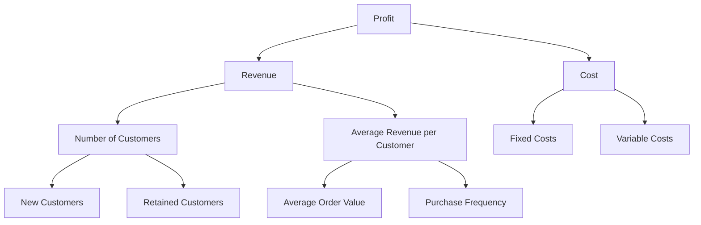

Metric trees are a hierarchical way to organise and visualise metrics that are important to a specific business area or use case. They show how high-level metrics break down into their underlying components, making it easier to understand what drives performance and where to focus improvement efforts.

A simple example is `profit`, which breaks down into `revenue` and `cost`, where `profit` = `revenue - cost`. But you can go deeper - `revenue` might break down into number of `customers` × `average revenue per customer`, and so on.

This creates a tree-like structure where you can trace any metric back to its root causes, helping teams understand not just what's happening, but why it's happening.

## Example 

## Why should we build metric trees
Metric trees make it easier to answer business questions. For example, if we see an increase in profit over the quarter, we'd celebrate but we'd equally want to know why. Having a metric tree available helps as a starting point for investigation methodology. For example:
- has revenue gone up/down? (yes/no [follow tree])
  - It's gone up, let's investigate
- has number of customers gone up/down? (yes/no [follow tree])
  - We have more customers, let's investigate
- Has new customer rate increased? (yes/no [follow tree]) 
  - Tree ends here, but from here we could add things like marketing campaigns, referrals, SEO, particularly if we run marketing as A/B tests and can tie back increases to particularly successful marketing campaigns. 

## Implementing metric trees 
:::tip
Metric trees aren't just for technical teams, they should be useful for a wide range of technical and non-technical stakeholders. It's useful to consider them as a `data product` but their use shouldn't be limited to just data people.
:::