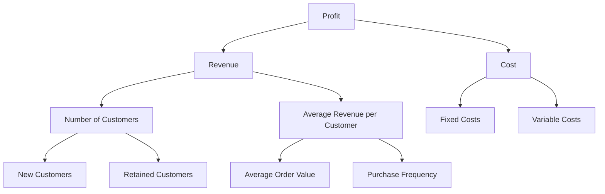
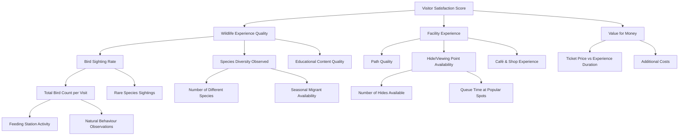

Metric trees are a hierarchical way to organise and visualise metrics that are important to a specific business area or use case. They show how high-level metrics break down into their underlying components, making it easier to understand what drives performance and where to focus improvement efforts.

A simple example is `profit`, which breaks down into `revenue` and `cost`, where `profit` = `revenue - cost`. But you can go deeper - `revenue` might break down into number of `customers` × `average revenue per customer`, and so on.

This creates a tree-like structure where you can trace any metric back to its root causes, helping teams understand not just what's happening, but why it's happening.

## Example 

## Why should we build metric trees
Metric trees make it easier to answer business questions. For example, if we see an increase in profit over the quarter, we'd celebrate but we'd equally want to know why. Having a metric tree available helps as a starting point for investigation methodology.

Metric trees transform vague questions like 'why did performance change?' into structured investigations that lead to actionable insights.

For example:
- has revenue gone up/down? (yes/no [follow tree])
  - It's gone up, let's investigate
- has number of customers gone up/down? (yes/no [follow tree])
  - We have more customers, let's investigate
- Has new customer rate increased? (yes/no [follow tree]) 
  - Tree ends here, but from here we could add things like marketing campaigns, referrals, SEO, particularly if we run marketing as A/B tests and can tie back increases to particularly successful marketing campaigns. 

## Implementing metric trees 
:::tip
Metric trees aren't just for technical teams, they should be useful for a wide range of technical and non-technical stakeholders. It's useful to consider them as a `data product` but their use shouldn't be limited to just data people.
:::

- Start with the most important outcome metric. For example, if we ran a bird sanctuary, visitor satisfaction might be our top level metric (we wouldn't be able to stay open if visitors thought our sanctuary sucked)
- By working with stakeholders we'd come to the conclusion that the satisfaction score is the product of 
  - Wildlife experience (did they see any birds? did they see what they wanted to see?)
  - Facility experience (was it clean? were the hide doors squeaky?)
  - Value for money (are we making enough money to cover our costs? are visitors feeling that they're getting value for money? Are they staying for a long time?)
- Then, we'd break each of these down into sub-sub-metrics 

We might build this starting with everything we could possibly ever envision contributing to a metric, and slim down later based on things like:
- Data we already have
- Data it's feasible to start collecting

For example, `total bird count per visit` isn't something that would be very easy to get an accurate count of for every visitor. We could ask visitors how many birds they saw, but not everyone would fill out the survey - or they might not always know how many birds they saw. 

However, that wouldn't mean we shouldn't capture this data. We might look to document and accept the limitations. For example, while we won't ever perfectly know how many birds every visitor saw, we would get sight of if avid bird watchers routinely saw nothing more than two pigeons and a sparrow; that would be a useful insight. 

